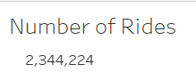
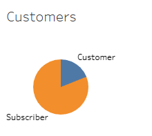
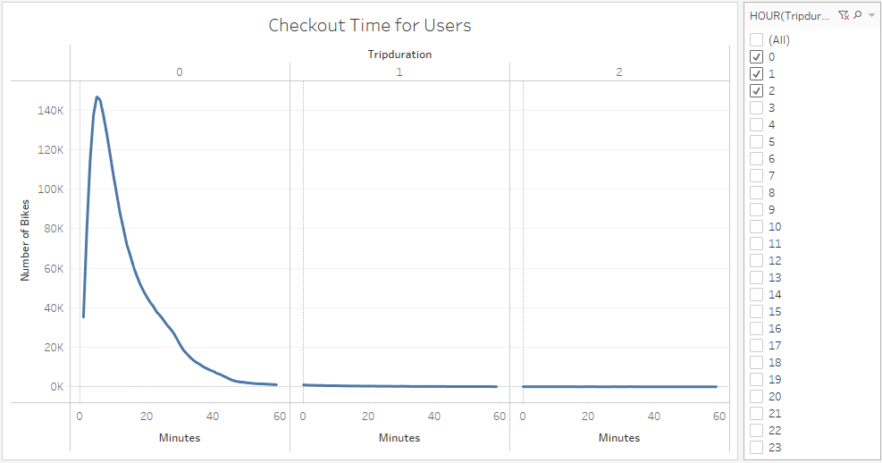
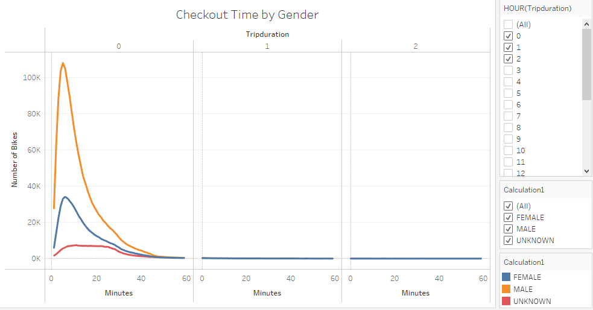
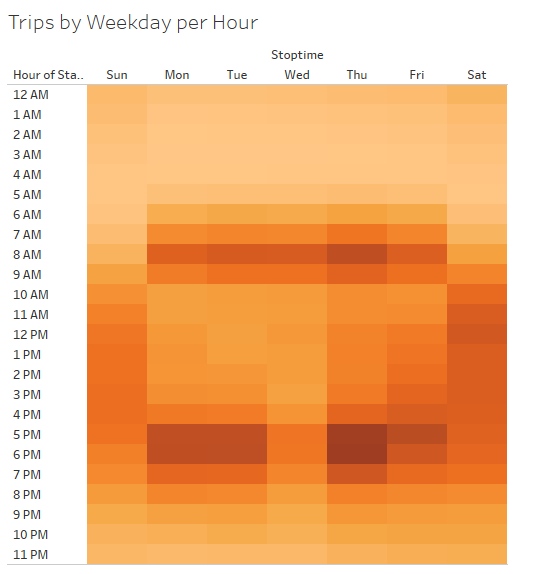
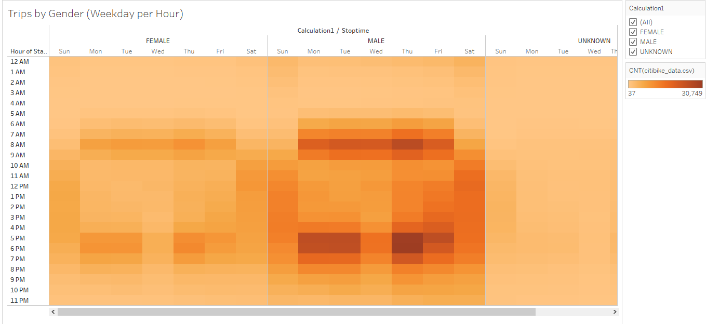
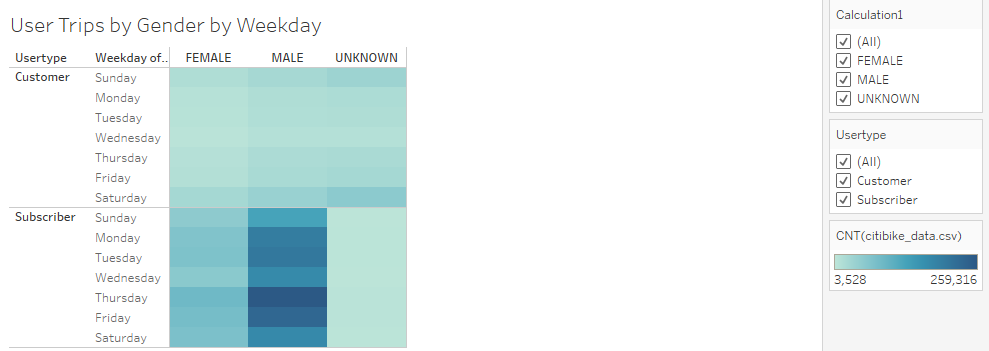

# Bikesharing
### Overview
The purpose oof this project was to create a presentation of visuals using Tableau, so investors can decide whether or not the want to invest in a bike-sharing program.
### Results
This is the total number of rides.

This pie chart shows the number of customers compared to the total number of subscribers.

This graph shows how long users are checking out bikes.

This graph shows how long users are checking out bikes based on gender.

This heat chart shows how many trips are being taken by the day of the week and the hour of the day.

This heat chart shows how many trips are being taken by the day of the week and the hour of the day based on gender.

This heat chart shows how many trips are being taken by the day of the week based on gender and user type.

### Summary
Based on all of the data you can conclude that males make up a large portion of the users. You can also conclude that subscribers make up a large majority of the user type, so most users are paying for a subscription and plan on being long term users. Another notable point is that most users are only using the bikes to go a short distance so the bikes are probably not going through a lot of wear and tear that would happen if they were being used for long periods of time. For future analysis I would suggest looking into trip duration by user type because I wonder if one-time customers are using the bikes for longer trips on average compared to subscribers. Another visual I think would be helpful would be a map of the most common end station and start station to see where users are using bikes the most. It would be interesting to if maybe users are using them more near schools or the beach or what areas are most common.

### Link to Tableau Public Dashboard
[link to dashboard](https://public.tableau.com/profile/jarred.heer#!/)
